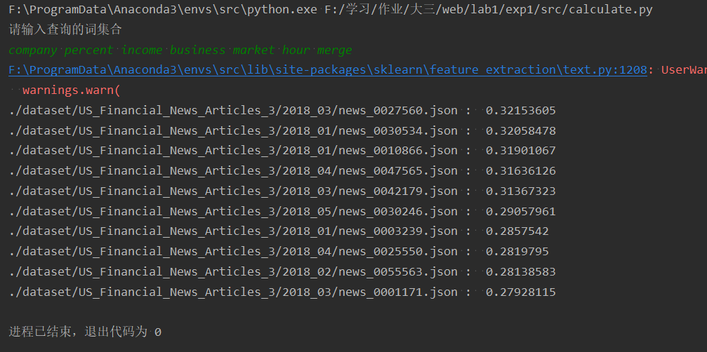
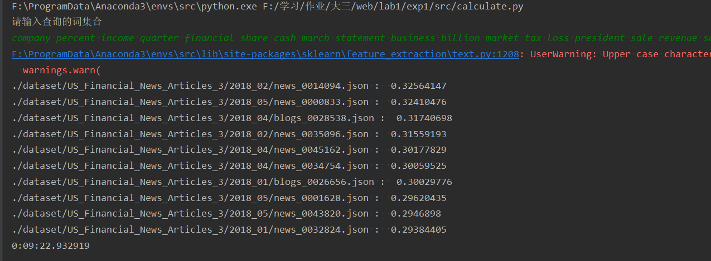

## 
WEB INFO LAB1实验报告

### 
PB19000352 易元昆 PB19000xxx 王晨晗

### TF-IDF 
***源码附在最后***
1. 检索所有文件夹，读取其中的text项目。调用库函数，进行分词、去停用词，词频统计，计算tf-idf。
   
通过[get_data.py](./src/semantic_search/get_data.py)文件实现

其中通过遍历所有json文件读取其中的`text`相关内容，并分别和所读取的文件路径存储与两个`list`表里面，通过`list[0]~list[len(list_file)]`调用不同文件的`text`相关信息。

调用库`scikit-learn`中的文本处理模块进行处理，其中``用于对原始数据进行处理包括标准化和去停用词，`TfidfTransformer`用于生成tf-idf矩阵。

生成完毕后一同存储与`tfidf_matrix.txt`文件中(分词后的词排序用`feature_name`存储，生成的tf-idf矩阵用`tf-idf`存储，存储类型为`scipy.sparse.csr.csr_matrix`稀疏矩阵，生成的字频统计用`count`存储，调用时按顺序读出)

存储是通过python库`pickle`实现，`pickle`库可以实现python`list、dict`等数据类型的存储和读取，方便后续处理数据

读取数据和建立矩阵大致需要5-8分钟(运行环境见[readme](readme.md))

1. 输入相应查询词，进行计算

通过[search.py](./src/semantic_search/search.py)文件实现

读入先前处理过的数据， 读入输入的查询词集合。对输入的查询词进行处理(仍然使用`vectorizer = CountVectorizer(vocabulary=feature_name)`此处附带参数为按照步骤2中生成的分词表生成稀疏矩阵)， 然后计算查询词的tf-idf向量。

通过`cosine_similarity()`函数计算查询词集合向量与原来生成的tf-idf向量的VSM，并返回最相似的10个文件的集合，然后输出

测试结果(此时数据集在src文件夹内，提交时已经更改)

此为简单单词的查询处理,运行时间7 min 55 s

此处输入了查词表中2/3的单词，输出结果如上所示，运行时间为9 min 23 s
